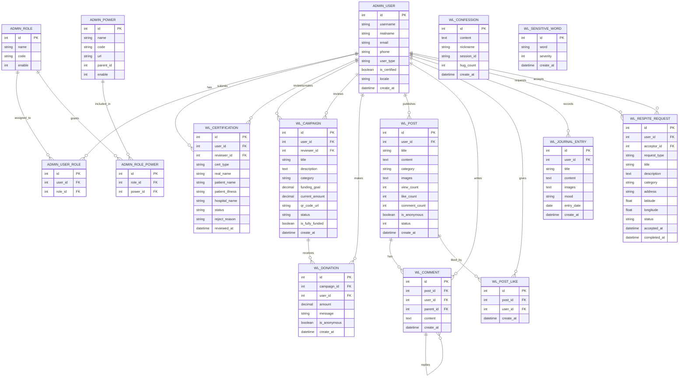

# Weilight Harbor Feedback Summary

## ER Diagram

The formal black-and-white Chen-style ER diagrams are available at:

- `docs/rendered/weilight-harbor-er-imagegen-bw.png` - raster diagram generated with imagegen
- `docs/weilight-harbor-er-chen.svg` - editable SVG version with verified entity and relationship labels

## Modification Summary

1. Respite Station map display issue

   The map page originally loaded with a world-level view, so local respite station markers were not visible unless the user manually zoomed far out or adjusted the map. The map initialization was adjusted so the view fits the station marker bounds by default, making nearby respite requests visible immediately after entering the page.

2. Annual Film record display issue

   The annual film page previously truncated journal text before rendering the slide, which caused records to appear incomplete. The backend now passes the full journal content to the film page, and the slide text area supports internal scrolling for longer entries, so complete records can be viewed without breaking the full-screen film layout.

3. Donation page refresh and scrolling issue

   After completing a donation, the page could remain in an old modal state, leaving the page unable to scroll when the user returned or re-entered the campaign page. The donation modal lifecycle was corrected to use a single Bootstrap-compatible open/close flow, clean up modal backdrop and scroll-lock styles, and refresh the campaign detail page after a successful donation so the updated amount and donor count are shown correctly.
